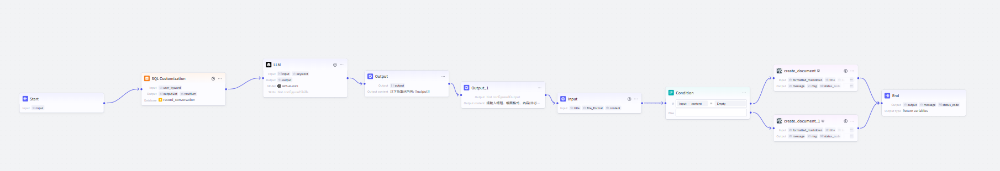
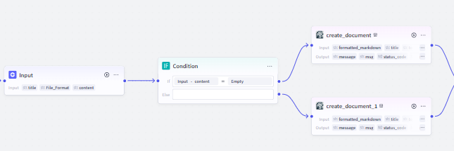

# 📂 Coze 輔助功能工作流：新增並匯出筆記 (`file_workflow`)

---

## 1. 功能概述

本工作流允許用戶 **查詢過往對話內容**，並透過 **LLM 生成整理後的筆記**，最終支援 **匯出筆記至指定格式**（如 `.pdf`、`.md` 等）。

📌 **主要功能：**
- **🔍 查詢關鍵字筆記內容**：從 `record_conversation` 資料庫檢索相關內容
- **📖 內容整理與優化**：利用 **LLM 生成** 結構化筆記
- **📄 多格式輸出**：根據用戶選擇 **匯出 `.pdf`、`.md` 等格式**

📌 **工作流總覽圖**：

---

## 2. 技術要點

### 1️⃣ **SQL 檢索與語意匹配**
- 在 **`record_conversation` 資料庫** 中查找與關鍵字 **相關的對話記錄**

### 2️⃣ **大語言模型（LLM）總結筆記**
- LLM (`GPT-4o mini`) **整理並提取筆記重點**
- 讓筆記內容 **更加精簡且結構化**

### 3️⃣ **用戶自訂筆記輸出**
- 允許用戶 **修改標題、格式、內容**
- **支援多種輸出格式**（如 `.pdf`、`.md`）

### 4️⃣ **自動匯出筆記**
- **根據用戶選擇的格式**，動態生成對應格式的筆記文件
- 確保筆記內容 **可供下載或進一步分享**

---

## 3. 工作流程運作流程

以下為 **完整的 Coze 工作流步驟**，每個步驟都有說明與過程截圖：

### 1️⃣ **使用者輸入筆記主題**
- **使用 `Input` 節點**，讓用戶輸入 **關鍵字**（作為筆記主題）
- **後續將依據此關鍵字檢索歷史對話**

📌 **工作流示意圖：**

---

### 2️⃣ **查詢資料庫 (`record_conversation`)**
- **透過 `SQL Customization` 搜尋歷史對話**，找出 **與關鍵字相關的對話記錄**
- 若無相關內容，則返回 **「查無筆記內容」**

📌 **工作流示意圖：**

---

### 3️⃣ **LLM 內容整理**
- **若有搜尋結果**，則將內容傳送至 **LLM (`GPT-4o mini`)**
- LLM 負責 **提取重點、重新組織筆記內容**

📌 **工作流示意圖：**

---

### 4️⃣ **用戶自訂筆記輸出**
- **使用 `Input` 節點** 讓用戶輸入：
  - 📌 **筆記標題**
  - 📝 **筆記格式**（`.pdf`、`.md` 等）
  - 📖 **筆記內容**（非必填，預設為LLM整理的內容）

📌 **工作流示意圖：**

---

### 5️⃣ **匯出筆記**
- **根據用戶選擇的格式，動態匯出筆記**
- 生成對應的筆記文件 (`.pdf`、`.md`)，提供下載

📌 **工作流示意圖：**

