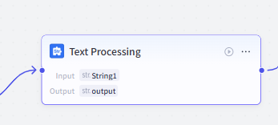
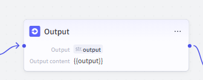
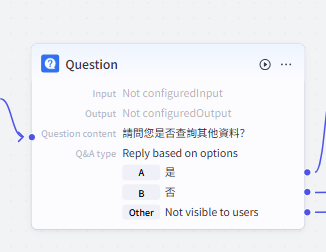
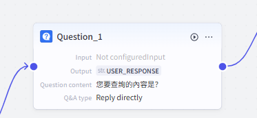
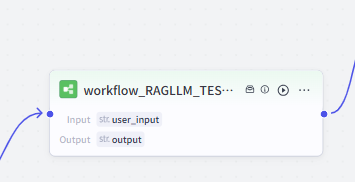
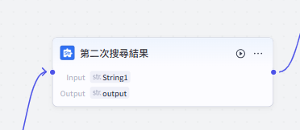
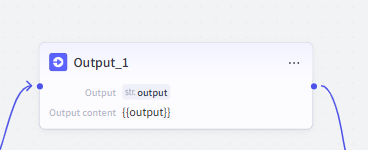
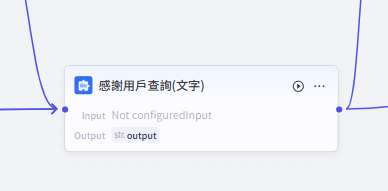
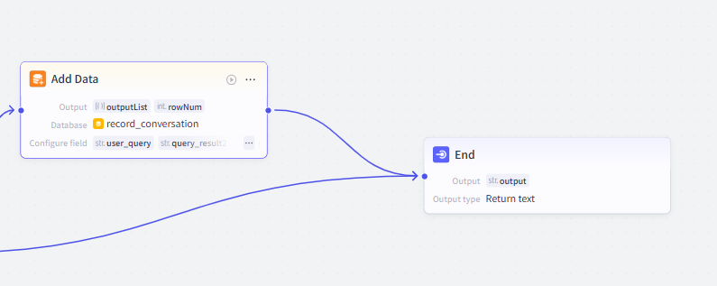

# 🎯 Coze 主程式工作流 (`workflow_RAG`)

---

## 1. 主程式概述
本專案透過 **Coze AI Agent開發平台**，建構一個 **基於檢索增強生成 (Retrieval-Augmented Generation, RAG)** 的課程查詢機器人。

### **📌 工作流的主要目標**
- **輸入解析**：使用 LLM 將用戶輸入翻譯為繁體中文，以利後續查詢
- **資料檢索**：透過 `Knowledge Retrieval` 插件，對課程摘要進行 **模糊搜尋 (Semantic Search)**，選取相關課程
- **LLM 組織輸出**：由 **大語言模型 (Large Language Model, LLM)** 生成 **概念解釋** 並整理推薦課程

📌 **工作流總覽圖**：


---

## 2. AI 技術應用
本系統主要應用了 **以下 AI 技術：**

### 1️⃣ **大語言模型 (Large Language Model, LLM)**
   - 用於 **翻譯用戶輸入**（翻譯成繁體中文）
   - 生成 **概念解釋**，幫助用戶理解查詢內容
   - 排序與整理推薦課程，確保最佳的結果呈現

### 2️⃣ **模糊搜尋 (Semantic Search)**
   - 透過 **Knowledge Retrieval**，使用 **向量相似度比對** 來進行 **語義檢索**
   - 可搜尋 **已建置的課程知識庫**，並選出 **最相關的課程摘要** 進行推薦

### 3️⃣ **檢索增強生成 (Retrieval-Augmented Generation, RAG)**
   - **融合 LLM + 知識庫檢索**，提高回應的準確度
   - 避免 LLM **「幻覺問題 (Hallucination)」**，確保回應內容與知識庫資料一致

---

## 3. 工作流程運作流程

以下為 **完整的 Coze 工作流步驟**，每個步驟都有說明與過程截圖：

---

### 1️⃣ **LLM 翻譯**
- **使用 LLM (`GPT-4o mini`)** 將用戶輸入內容翻譯成 **繁體中文**
- 這是為了確保與課程摘要的語言一致，提升檢索準確度

#### 📌 LLM 翻譯的 Prompt
```text
# 角色
你是一個翻譯專家。請將用戶輸入的文字翻譯成繁體中文。
如果沒有任何內容可翻譯，請直接輸出 {{user_input}}。
用戶輸入：{{user_input}}
# 請只輸出翻譯結果，不要加入其他解釋或內容。
```


📌 **工作流示意圖：**  


---

### 2️⃣ **Knowledge Retrieval 模糊搜尋**
- **使用 Knowledge Retrieval**，將用戶查詢與 **知識庫內的課程摘要** 進行 **語意比對**
- **檢索策略 (Search Strategy)**：`Semantic Search`
- **最多選取 15 筆** 相關課程作為候選清單

📌 **工作流示意圖：**  


---

### 3️⃣ **LLM 生成課程推薦**
- **使用 LLM (`GPT-4o mini`)** 進一步篩選出 **相關度最高的 5 筆課程**
- **自動生成概念解釋**，幫助用戶理解查詢內容

#### 📌 LLM 整理輸出的 Prompt
```text
# 角色：智能課程推薦助手 – 結果整理專家
你是一個智能課程推薦助手，負責從候選課程清單中根據相關性排序，選出最符合用戶查詢的 5 筆課程資料，，並生成 1-2 句簡短概念解釋，無論是否有資料，都要向用戶進行概念解釋。  
請注意：
- 僅使用以下候選課程清單，不得自行生成任何新內容。
- 所有資訊（例如課程名稱、授課單位與教師、課程單元、課程網址）必須直接引用知識庫中的資料。
- 如果候選清單中符合條件的資料不足 5 筆，請直接返回現有資料，不要自行補充；若無任何資料，回應目前尚無相關資料。

候選課程清單如下：
{{candidate_courses}}

請以以下格式返回最終結果：

🔹 **你的問題**  
「{{translated_text}}」

🔹 **簡短概念解釋**  
📖 {LLM生成的問題概念解釋}

🔹 **推薦課程**  
1️⃣ **{課程名稱 1}** - {授課單位與教師 1}  
   📖 **課程單元**：{課程單元 1}  
   🎥 **影片連結**：[點擊觀看]({課程網址 1})

2️⃣ **{課程名稱 2}** - {授課單位與教師 2}  
   📖 **課程單元**：{課程單元 2}  
   🎥 **影片連結**：[點擊觀看]({課程網址 2})

3️⃣ **{課程名稱 3}** - {授課單位與教師 3}  
   📖 **課程單元**：{課程單元 3}  
   🎥 **影片連結**：[點擊觀看]({課程網址 3})

4️⃣ **{課程名稱 4}** - {授課單位與教師 4}  
   📖 **課程單元**：{課程單元 4}  
   🎥 **影片連結**：[點擊觀看]({課程網址 4})

5️⃣ **{課程名稱 5}** - {授課單位與教師 5}  
   📖 **課程單元**：{課程單元 5}  
   🎥 **影片連結**：[點擊觀看]({課程網址 5})
```
📌 **工作流示意圖：** 


### 4️⃣ **Text Processing 文字處理**
- **使用文字處理模組**，進一步整理 **LLM 生成的課程推薦結果**
- 主要進行：
  - 格式優化，確保輸出內容整齊易讀
  - 過濾不必要的標點或額外空格
  - 確保鏈接格式正確，使用者能夠點擊觀看課程

📌 **工作流示意圖：** 



---

### 5️⃣ **Output 查詢結果輸出**
- **將整理好的課程推薦資訊顯示給用戶**
- 輸出格式包含：
  - **用戶查詢問題**
  - **簡要概念解釋**
  - **推薦課程清單（最多 5 筆）**


📌 **工作流示意圖：** 



---

### 6️⃣ **詢問用戶是否查詢其他課程**
- **用戶決策點**：
  - **若選擇「是」** ➜ 進入步驟7，重新啟動查詢流程
  - **若選擇「否」** ➜ 顯示「感謝您的查詢！」（步驟11），結束對話
- 這一步驟讓用戶可以 **進行一次新的查詢**，但不會無限循環，確保互動體驗流暢

📌 **工作流示意圖：**



---

### 7️⃣ **詢問用戶「您要查詢的內容是？」**
---
- **用戶將透過「直接回答式」輸入新的查詢內容**

📌 **工作流示意圖：**  



---

### 8️⃣ **重新啟動查詢流程**
- **此流程會再次執行** `步驟 1 - 3`，以獲取新的查詢結果
- **提升互動體驗**，讓用戶能循環查詢不同課程，而不會限制只能查詢一次

📌 **工作流示意圖：**  



---

### 9️⃣ **第二次查詢結果**
- **使用 Text Processing** 進行格式整理
- 確保輸出結果與第一次查詢格式一致，維持最佳閱讀體驗

📌 **工作流示意圖：**  



---

### 🔟 **第二次查詢結果輸出**
- **將整理好的課程推薦資訊顯示給用戶**

📌 **工作流示意圖：**  



---

### 1️⃣1️⃣**結束查詢**
- 確保最終輸出為 **標準回應格式**
- **輸出：「感謝您的查詢！」**，確認查詢流程圓滿結束

📌 **工作流示意圖：**



---

### 1️⃣2️⃣**記錄查詢數據**
---
- **建立資料庫 `record_conversation`**
- **新增資料庫欄位**：
  -  `user_query`：儲存用戶的查詢內容
  -  `query_result`：儲存系統回應的查詢結果
- **在工作流結束前，蒐集以下資訊**：
  -  **用戶輸入**：
    - `input1`（初始查詢內容）
    - `input2`（若用戶有進行多次查詢）
  -  **機器人回應**：
    - `output1`（首次回應結果）
    - `output2`（若用戶進行多次查詢，提供對應結果）
- **更新以下資訊到資料庫**：
  -  **User ID**
  -  **查詢時間**
  -  **部分額外的數據**

📌 **工作流示意圖：**  



## 📌 Coze 工作流步驟 Input/Output 對照表

| **步驟** | **名稱** | **Input** | **Output** |
|----------|---------|----------|-----------|
| 1️⃣ | **LLM 翻譯** | `user_input` | `translated_text` |
| 2️⃣ | **Knowledge Retrieval 模糊搜尋** | `translated_text` | `candidate_courses` |
| 3️⃣ | **LLM 生成課程推薦** | `candidate_courses`, `translated_text` | `output` (包含課程清單 & 概念解釋) |
| 4️⃣ | **Text Processing 文字處理** | `output` | `formatted_output1` |
| 5️⃣ | **Output 查詢結果輸出** | `formatted_output1` | `output1` |
| 6️⃣ | **詢問用戶是否查詢其他課程** |-| `new_query` (若用戶選擇「是」) |
| 7️⃣ | **詢問用戶「您要查詢的內容是？」** | `new_query` | `user_input` |
| 8️⃣ | **重新啟動查詢流程** | `user_input` | `workflow_output` |
| 9️⃣ | **第二次查詢結果處理** | `workflow_output` | `formatted_output_2` |
| 🔟 | **第二次查詢結果輸出** | `formatted_output_2` | `output2` |
| 1️⃣1️⃣ | **結束查詢** | - | `"感謝您的查詢！"` |
| 1️⃣2️⃣ | **記錄查詢數據** | `user_query`, `user_query2`, `query_result`, `query_result2` | `outputList` |


