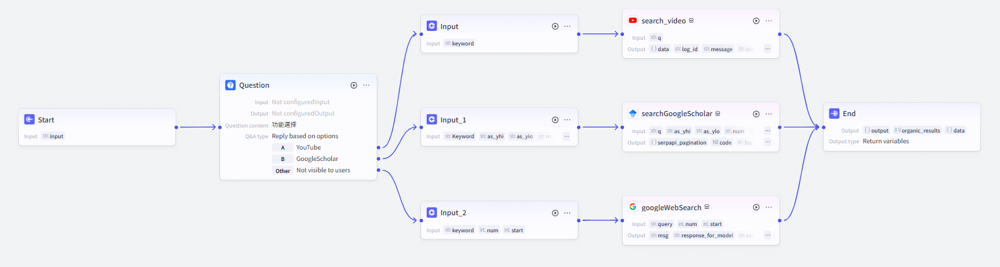
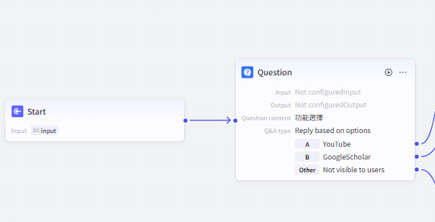
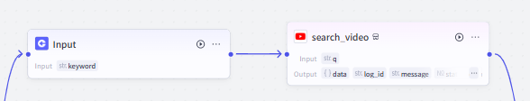
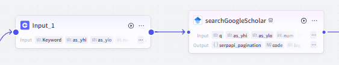
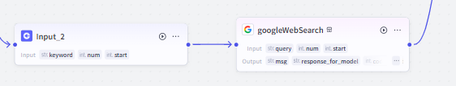
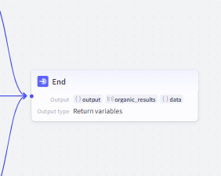

# 🔎 Coze 輔助功能工作流：搜尋其他平台 (`yt_and_googlescholar_workflow`)
## 1. 功能概述

本工作流允許用戶選擇不同的搜尋平台來查詢相關內容，支援 **YouTube、Google Scholar 及 Google 搜尋**。

📌 **主要功能**：
- **YouTube 搜尋**：允許用戶輸入關鍵字，查詢 YouTube 影片
- **Google Scholar 搜尋**：支援輸入關鍵字與論文年份參數，查詢學術論文
- **Google 搜尋**：進行一般網頁搜尋

📌 **工作流總覽圖**：

---
## 2. 技術要點
### 🔹 **1. 多來源檢索整合**  
- **YouTube 影片搜尋** ➜ **`YouTube Data API`**  
- **Google Scholar 學術搜尋** ➜ **`Google Scholar API`**  
- **Google Web 搜尋** ➜ **`Google Search API`**  

📌 **確保支援不同平台的查詢，滿足多種資訊需求。**  

---

### 🔹 **2. 智能動態輸入處理**  
- **用戶可選擇搜尋類型**（YouTube、Google Scholar、Google）  
- **依不同搜尋模式，自動調整輸入參數**：
  - `YouTube` 搜尋：僅需關鍵字  
  - `Google Scholar` 搜尋：可額外設定 **論文年份** 範圍  
  - `Google` 搜尋：可調整 **回傳結果數量**  

📌 **提高靈活性，讓用戶能根據需求調整搜尋條件。**  

---

### 🔹 **3. 以 API 為核心的即時查詢機制**  
- **即時發送 API 請求**，確保查詢結果是最新的  
- **多線程並行搜尋**，加快查詢速度，減少等待時間  
- **透過 JSON 解析與過濾機制**，確保輸出格式清晰  

📌 **透過 API 直接調用數據源，避免過時資訊，提高搜尋準確度。**  

---

### 🔹 **4. 結果整合與標準化輸出**  
- **不同來源的查詢結果，統一整理輸出**  
- **確保結果格式一致，包括標題、來源、連結等**  
- **適用於AI Agent的結構化回應格式**  

📌 **確保用戶獲得清晰、易讀的搜尋結果，提高體驗。**  
---

## 3. 工作流程運作流程

以下為 **完整的 Coze 工作流步驟**，每個步驟都有說明與過程截圖：

---

### 1️⃣ **用戶選擇搜尋類型**
- **使用 `Question` 節點**，詢問用戶希望搜尋的類型
- 提供選項：
  - **A：YouTube**
  - **B：Google Scholar**
  - **其他：Google 預設搜尋**

📌 **工作流示意圖：**

---

### 2️⃣ **YouTube 搜尋**
- **用戶輸入關鍵字**
- **透過 `search_video` 外掛**，查詢 YouTube 影片
- **輸出搜尋結果**

📌 **工作流示意圖：**

---

### 3️⃣ **Google Scholar 搜尋**
- **用戶輸入關鍵字**
- **可選擇性地輸入論文年份範圍**
- **透過 `searchGoogleScholar` 外掛**，查詢 Google Scholar 論文
- **輸出搜尋結果**

📌 **工作流示意圖：**

---

### 4️⃣ **Google 搜尋**
- **用戶輸入關鍵字**
- **可選擇性地輸入最大回傳結果數**
- **透過 `googleWebSearch` 外掛**，執行 Google 搜尋
- **輸出搜尋結果**

📌 **工作流示意圖：**

---

### 5️⃣ **結果輸出**
- **整合各搜尋來源的結果**
- **將搜尋結果返回給用戶**
- **工作流結束**

📌 **工作流示意圖：**

---
