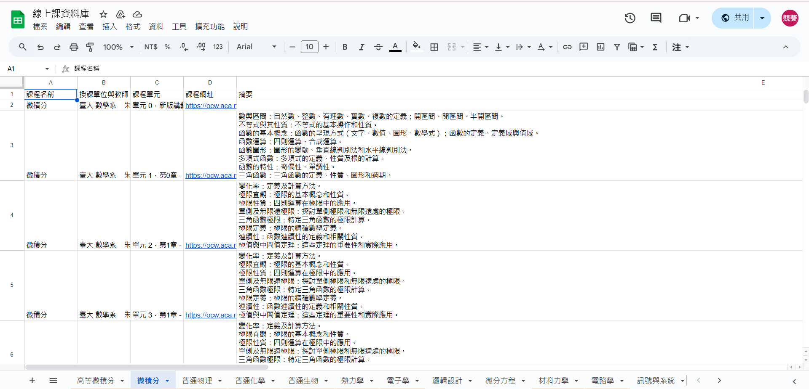

# Python 爬蟲流程

以下說明如何使用Python + gspread + BeautifulSoup等工具，抓取各校公開課程並寫入Google Sheets的步驟。

> **前置作業**：  
> - 確認已安裝 Python 3.x  
> - 建議安裝下列套件：`requests`、`beautifulsoup4`、`gspread`、`google-auth`  
> - 在Google Cloud Console申請並下載Service Account JSON憑證，用於存取Google Sheets API

---

## 流程步驟

1. **讀取並載入Google Sheets API憑證**  
   - 先到 [Google Cloud Console](https://console.cloud.google.com/) 建立並下載Service Account JSON檔  
   - 在程式中使用 `Credentials.from_service_account_file("YOUR_SECRET_KEY.json")` 讀取金鑰  

2. **使用gspread連線至Google Sheets**  
   - 安裝 `gspread` 套件（`pip install gspread`）  
   - 連線後取得對應的試算表與工作表  
   - 範例：  
     ```python
     import gspread
     from google.oauth2.service_account import Credentials
     credentials = Credentials.from_service_account_file(
         'YOUR_SECRET_KEY.json',
         scopes=["https://www.googleapis.com/auth/spreadsheets"]
     )
     gc = gspread.authorize(credentials)
     sh = gc.open_by_url("https://docs.google.com/spreadsheets/d/...")
     worksheet = sh.worksheet("工作表名稱")
     ```

3. **設定目標網站 URL**  
   - 根據不同大學的公開課網址，在程式裡指定 `url = "..."`  
   - 之後會針對每個學校網址做相同或相似的處理

4. **發送HTTP Request來訪問目標網站，並檢查網站回應是否正常**  
   - 使用 `requests.get(url)` 抓取目標網站HTML內容  

5. **使用BeautifulSoup解析網站回應的HTML內容**  
   - 安裝 `beautifulsoup4`（`pip install beautifulsoup4`）  
   - 透過 `BeautifulSoup` 找出所需資訊(課程名稱/授課單位與教師/課程單元/課程網址)  
   - 範例：  
     ```python
     import requests
     from bs4 import BeautifulSoup
     response = requests.get(url)
     soup = BeautifulSoup(response.text, "html.parser")

6. **將整理後的資料以行的方式寫入Google Sheets**   
   - 最後可以Google Sheet中查看成果
  
# Google Sheet（資料庫）資料格式

爬蟲成功抓取各校公開課資訊後，會將結果以行的方式寫入Google Sheets，如下圖所示：


(以微積分為例)

> 在這個試算表中，我們主要的欄位包含：
> - **課程名稱**：該公開課程的標題
> - **授課單位與教師**：如學校、系所名稱、教授姓名
> - **課程單元**：該公開課程的各項單元
> - **課程網址**：連結到公開課程的詳細介紹或影片
> - **摘要**：該公開課程的課程摘要（由GPT讀取講義後生成）
  

